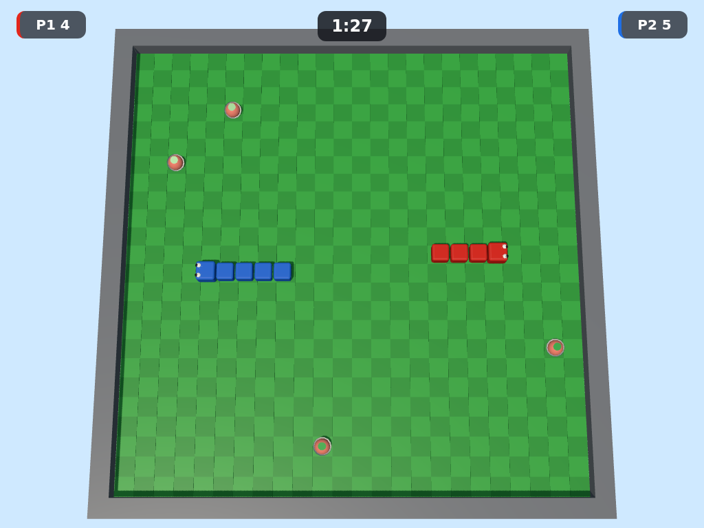
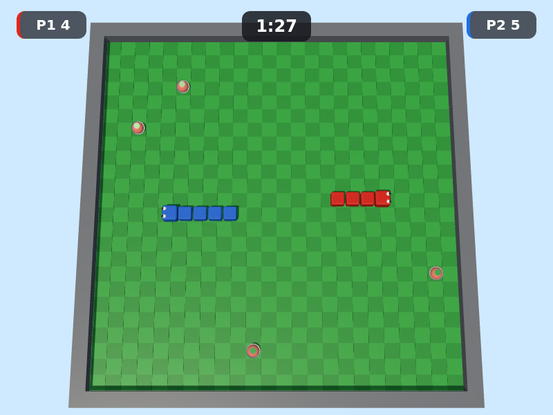
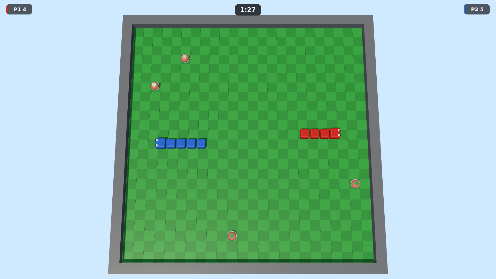
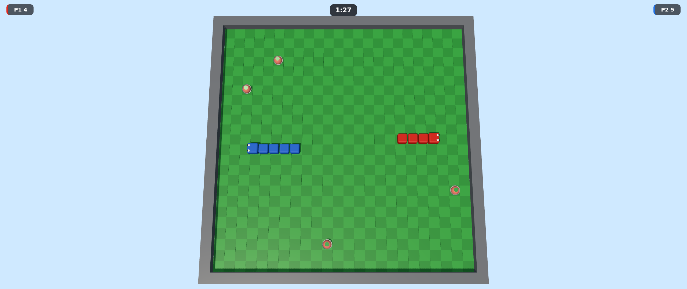
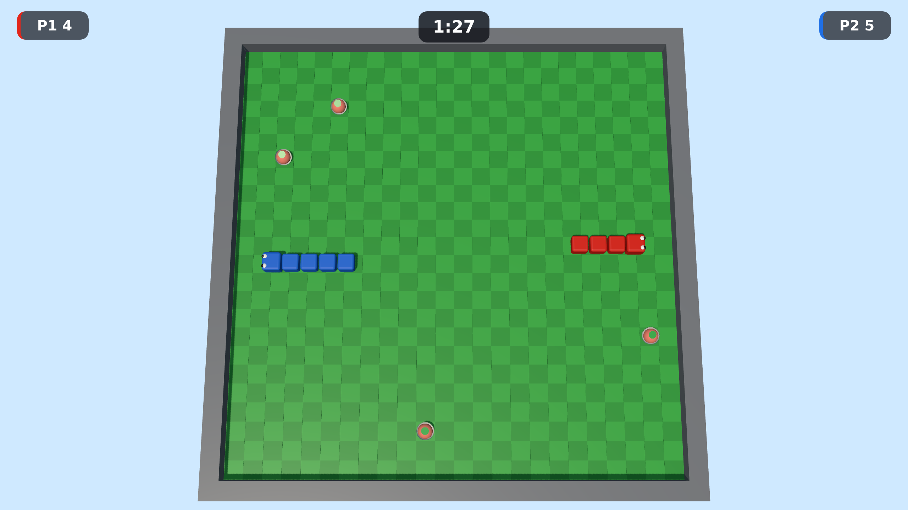
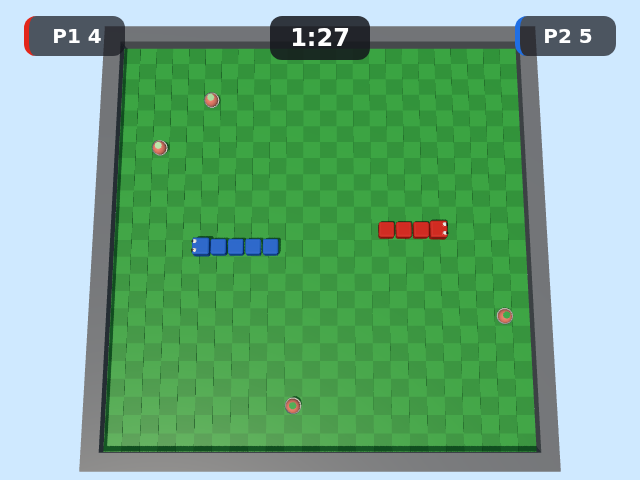

# Viewport matrix — the game at seven sizes

KI-16-01 · Improvement 16 (`docs/sprints/improvement-16-viewport-and-resize.md`)

**This ticket measures. It does not fix anything.** Every row below is a number, not a verdict — a `false` or
an overlap area here is the expected, correct output of a camera and a HUD that were only ever designed and
baselined at 1280×720 (`DESIGN-DECISIONS §1 row 24`). KI-16-02 (the framing rule) and KI-16-03 (the HUD)
are where a finding here turns into a fix.

## What actually ran

- **Command:** `KI_VIEWPORTS=1 npm run test:agent:viewports`
- **Date:** 2026-09-08.
- **Wall time:** ~37s.
- **Engine:** Chromium (the same engine every other committed baseline in this repository is measured on).
- **Query:** `?test=1&seed=1&reducedFx=1` — the same seed and reduced-effects flag every visual baseline uses,
  so the arena and HUD are in the same deterministic layout on every regeneration.
- **How each viewport was sized:** `page.setViewportSize()` for every DPR-1 row, and — because Playwright only
  lets `deviceScaleFactor` be set at context creation — `browser.newContext({ viewport, deviceScaleFactor: 2 })`
  for the `1280x720@2` row alone.
- **How the mid-round frame was reached:** the real `main menu → match setup → countdown → PLAYING` flow
  through `__kobi.startMatch`, stepped past the countdown, then one `fastForward(2)`
  that both advances 2 simulated seconds into the round and renders the frame this
  document measures — `fastForward` renders once at the end of its call, never per intermediate step, so this
  costs one render per viewport.
- **How the laser banner was reached:** `__kobi.setSettingsOverrides({ laserStartTime })` with
  `laserStartTime` set to `roundDuration − 1` s, called before a fresh
  `__kobi.startMatch` — the supported route (`tests/agent/README.md`'s "Sweeping a setting"; `src/core/
  settings.js` itself was never touched) — so `LASER_WARNING` fires about 1
  simulated second into the round rather than at the shipping default's 60 s in. This is what keeps the whole
  matrix cheap: seven viewports × two short rounds each, not seven full rounds played out to a real warning.

## What was measured, and why

- **"Is the whole arena on screen"** projects two distinct point sets through `__kobi.projectToNdc` (the new
  seam onto `THREE.Vector3.prototype.project`, `src/render/renderer.js`, forwarded by
  `src/game/testHooks.js`; both declared deviations from this ticket's own `Files:` list, per the PR
  description) — never by eye:
  - the **floor rectangle plus one wall thickness of camera margin**, at floor level (`y = 0`):
    `x, z ∈ {−margin, gridWidth + margin} × {−margin, gridHeight + margin}`, `margin =
    SETTINGS.camera.margin` — `DESIGN-DECISIONS §1 row 24`'s own framing target, and exactly the box
    `render/camera.js`'s `solveCameraDistance` was solved to fit.
  - the **wall ring's own real geometry**, at its own top (`WALL_HEIGHT`): `x, z ∈ {−WALL_THICKNESS,
    gridWidth + WALL_THICKNESS} × {−WALL_THICKNESS, gridHeight + WALL_THICKNESS}` — `arenaView.js`'s own
    slab extent, never the camera-margin box. **An earlier draft of this measurement conflated the two** —
    it projected the margin box raised to wall height, which is empty framing headroom, not a point any
    geometry occupies, and reported a "wall overflow" that was a phantom (tech-lead review on this ticket's
    PR). The corrected run below finds no such thing.

  Inside the frame means every projected point has `|x| ≤ 1` and `|y| ≤ 1` in normalized device
  coordinates. Both groups are measured, because the camera's steep pitch (78° below horizontal, not a true
  top-down 90°) means an elevated point does not project to the same screen position as the floor point
  beneath it — a check that only ever looked at `y = 0` could not rule out the wall's own geometry
  independently. See "What this found" for what the corrected projection actually shows.
- **"Does a HUD pill overlap the arena" / "does the banner overlap a pill"** are answered by
  `getBoundingClientRect()` on `.hud-player--p1`, `.hud-player--p2` and `.hud-laser-banner`, per AC2 —
  never by eye. The arena's own NDC bounds are converted into the same CSS-pixel space as those rects (against
  the canvas's own `getBoundingClientRect()`) before the two are compared, so "overlap" is one rectangle
  intersection, reported as a boolean **and** the overlap area in px² so a near-miss reads as a near-miss
  rather than hiding behind a bare `false`.
- **Canvas backing size** is `canvas.width`/`canvas.height` (the WebGL drawing buffer) next to
  `getBoundingClientRect()` (the CSS box) and `window.devicePixelRatio`. `renderer.js`'s own
  `MAX_PIXEL_RATIO` is 2, so the `1280x720@2` row is the one expected to show a 2560×1440 buffer behind a
  1280×720 CSS box; every other row is expected to show a 1:1 buffer-to-box ratio.

## What this found

- **Arena framing is correct at every measured viewport.** The floor rectangle plus one wall thickness of camera margin (`DESIGN-DECISIONS §1 row 24`'s own framing target) and the wall ring's own real geometry both stay inside the frame at all 7 viewports — nothing is cut off, at any aspect ratio in the list.
- **The near-edge fit has zero slack.** The floor-plus-margin box's near edge (the corner closest to the camera) lands on the frustum boundary to within one floating-point ULP at every viewport — the largest gap measured is 2.22e-16 of the NDC range, which is float noise, not a real margin. `render/camera.js`'s vertical-FOV constraint binds the camera distance whenever the viewport's aspect ratio exceeds roughly 1.023 (`1 / sin(78°)`, since the arena is square) — every viewport in this list is 4:3 (1.333) or wider, so the height constraint is what's tight everywhere measured, and the camera distance the framing solve produces is therefore identical across every landscape viewport here (see the matrix below — the same distance would show up as the same near-edge NDC y, which it does).
- **HUD pills vs. the arena:** at least one player pill overlaps the arena at 3 of 7 viewports — 1024x768, 800x600, 640x480. KI-16-03's job, not this ticket's.
- **Laser banner vs. the pills:** the "LASERS CLOSING!" banner does not overlap either player pill at any measured viewport.

## The matrix

| Viewport | Why | Canvas backing size | Canvas CSS box | DPR | Whole arena on screen (NDC bounds) | Floor near-edge NDC y | P1 pill overlaps arena | P2 pill overlaps arena | Banner overlaps a pill | Screenshot |
|---|---|---|---|---|---|---|---|---|---|---|
| 1280x720 | the confirmed picture; every existing baseline | 1280×720 | 1280×720 | 1 | yes (x -0.575…0.575, y -1.000…0.891) | -1.0000000000000002 | no (0 px²) | no (0 px²) | no (P1 0 px², P2 0 px²) | [screenshot](viewports/1280x720.png) |
| 1024x768 | 4:3 laptop | 1024×768 | 1024×768 | 1 | yes (x -0.767…0.767, y -1.000…0.891) | -1.0000000000000002 | yes (80 px²) | yes (80 px²) | no (P1 0 px², P2 0 px²) | [screenshot](viewports/1024x768.png) |
| 800x600 | the school laptop | 800×600 | 800×600 | 1 | yes (x -0.767…0.767, y -1.000…0.891) | -1.0000000000000002 | yes (742 px²) | yes (742 px²) | no (P1 0 px², P2 0 px²) | [screenshot](viewports/800x600.png) |
| 1920x1080 | ARCHITECTURE §12's own resolution | 1920×1080 | 1920×1080 | 1 | yes (x -0.575…0.575, y -1.000…0.891) | -1.0000000000000002 | no (0 px²) | no (0 px²) | no (P1 0 px², P2 0 px²) | [screenshot](viewports/1920x1080.png) |
| 2560x1080 | ultrawide | 2560×1080 | 2560×1080 | 1 | yes (x -0.431…0.431, y -1.000…0.891) | -1.0000000000000002 | no (0 px²) | no (0 px²) | no (P1 0 px², P2 0 px²) | [screenshot](viewports/2560x1080.png) |
| 1280x720@2 | high-DPI | 2560×1440 | 1280×720 | 2 | yes (x -0.575…0.575, y -1.000…0.891) | -1.0000000000000002 | no (0 px²) | no (0 px²) | no (P1 0 px², P2 0 px²) | [screenshot](viewports/1280x720@2.png) |
| 640x480 | the stated minimum | 640×480 | 640×480 | 1 | yes (x -0.767…0.767, y -1.000…0.891) | -1.0000000000000002 | yes (1507 px²) | yes (1507 px²) | no (P1 0 px², P2 0 px²) | [screenshot](viewports/640x480.png) |

**Floor near-edge NDC y** is the floor-plus-margin box's own near-edge bound (`floorNdcBounds.minY`), at full float precision — this is the number "What this found" calls a zero-slack fit: it sits a single floating-point ULP past `-1.0`, identically at every viewport, because the vertical framing constraint binds regardless of aspect ratio (see below). A row marked *(… outside)* names which of the two groups — the floor-plus-margin framing box, or the wall ring's own real geometry — actually left the frame; none does at any viewport measured here.

## Screenshots

### 1280x720 (1280×720, DPR 1)


### 1024x768 (1024×768, DPR 1)



### 800x600 (800×600, DPR 1)



### 1920x1080 (1920×1080, DPR 1)



### 2560x1080 (2560×1080, DPR 1)



### 1280x720@2 (1280×720, DPR 2)



### 640x480 (640×480, DPR 1)



## Machine-readable data

The exact rows tabulated above, one object per viewport — what `tests/agent/viewports.test.js` diffs the
committed document against on every `npm run test:unit`.

```json
{
  "rows": [
    {
      "slug": "1280x720",
      "width": 1280,
      "height": 720,
      "dpr": 1,
      "why": "the confirmed picture; every existing baseline",
      "ndcBounds": {
        "minX": -0.5750665846115792,
        "maxX": 0.5750665846115792,
        "minY": -1.0000000000000002,
        "maxY": 0.8913456541735384
      },
      "onScreen": true,
      "floorNdcBounds": {
        "minX": -0.5750665846115792,
        "maxX": 0.5750665846115792,
        "minY": -1.0000000000000002,
        "maxY": 0.8913456541735384
      },
      "floorOnScreen": true,
      "wallTopNdcBounds": {
        "minX": -0.5644834141783208,
        "maxX": 0.5644834141783208,
        "minY": -0.9655470171545671,
        "maxY": 0.8910293292634331
      },
      "wallTopOnScreen": true,
      "canvasBackingWidth": 1280,
      "canvasBackingHeight": 720,
      "canvasCssWidth": 1280,
      "canvasCssHeight": 720,
      "devicePixelRatio": 1,
      "p1OverlapsArena": {
        "overlaps": false,
        "areaPx2": 0
      },
      "p2OverlapsArena": {
        "overlaps": false,
        "areaPx2": 0
      },
      "laserWarningReached": true,
      "bannerOverlapsP1": {
        "overlaps": false,
        "areaPx2": 0
      },
      "bannerOverlapsP2": {
        "overlaps": false,
        "areaPx2": 0
      },
      "bannerOverlapsAnyPill": false
    },
    {
      "slug": "1024x768",
      "width": 1024,
      "height": 768,
      "dpr": 1,
      "why": "4:3 laptop",
      "ndcBounds": {
        "minX": -0.7667554461487724,
        "maxX": 0.7667554461487724,
        "minY": -1.0000000000000002,
        "maxY": 0.8913456541735384
      },
      "onScreen": true,
      "floorNdcBounds": {
        "minX": -0.7667554461487724,
        "maxX": 0.7667554461487724,
        "minY": -1.0000000000000002,
        "maxY": 0.8913456541735384
      },
      "floorOnScreen": true,
      "wallTopNdcBounds": {
        "minX": -0.7526445522377612,
        "maxX": 0.7526445522377612,
        "minY": -0.9655470171545671,
        "maxY": 0.8910293292634331
      },
      "wallTopOnScreen": true,
      "canvasBackingWidth": 1024,
      "canvasBackingHeight": 768,
      "canvasCssWidth": 1024,
      "canvasCssHeight": 768,
      "devicePixelRatio": 1,
      "p1OverlapsArena": {
        "overlaps": true,
        "areaPx2": 79.64686282539589
      },
      "p2OverlapsArena": {
        "overlaps": true,
        "areaPx2": 79.86993675043712
      },
      "laserWarningReached": true,
      "bannerOverlapsP1": {
        "overlaps": false,
        "areaPx2": 0
      },
      "bannerOverlapsP2": {
        "overlaps": false,
        "areaPx2": 0
      },
      "bannerOverlapsAnyPill": false
    },
    {
      "slug": "800x600",
      "width": 800,
      "height": 600,
      "dpr": 1,
      "why": "the school laptop",
      "ndcBounds": {
        "minX": -0.7667554461487724,
        "maxX": 0.7667554461487724,
        "minY": -1.0000000000000002,
        "maxY": 0.8913456541735384
      },
      "onScreen": true,
      "floorNdcBounds": {
        "minX": -0.7667554461487724,
        "maxX": 0.7667554461487724,
        "minY": -1.0000000000000002,
        "maxY": 0.8913456541735384
      },
      "floorOnScreen": true,
      "wallTopNdcBounds": {
        "minX": -0.7526445522377612,
        "maxX": 0.7526445522377612,
        "minY": -0.9655470171545671,
        "maxY": 0.8910293292634331
      },
      "wallTopOnScreen": true,
      "canvasBackingWidth": 800,
      "canvasBackingHeight": 600,
      "canvasCssWidth": 800,
      "canvasCssHeight": 600,
      "devicePixelRatio": 1,
      "p1OverlapsArena": {
        "overlaps": true,
        "areaPx2": 741.9481551949957
      },
      "p2OverlapsArena": {
        "overlaps": true,
        "areaPx2": 742.3138379489349
      },
      "laserWarningReached": true,
      "bannerOverlapsP1": {
        "overlaps": false,
        "areaPx2": 0
      },
      "bannerOverlapsP2": {
        "overlaps": false,
        "areaPx2": 0
      },
      "bannerOverlapsAnyPill": false
    },
    {
      "slug": "1920x1080",
      "width": 1920,
      "height": 1080,
      "dpr": 1,
      "why": "ARCHITECTURE §12's own resolution",
      "ndcBounds": {
        "minX": -0.5750665846115792,
        "maxX": 0.5750665846115792,
        "minY": -1.0000000000000002,
        "maxY": 0.8913456541735384
      },
      "onScreen": true,
      "floorNdcBounds": {
        "minX": -0.5750665846115792,
        "maxX": 0.5750665846115792,
        "minY": -1.0000000000000002,
        "maxY": 0.8913456541735384
      },
      "floorOnScreen": true,
      "wallTopNdcBounds": {
        "minX": -0.5644834141783208,
        "maxX": 0.5644834141783208,
        "minY": -0.9655470171545671,
        "maxY": 0.8910293292634331
      },
      "wallTopOnScreen": true,
      "canvasBackingWidth": 1920,
      "canvasBackingHeight": 1080,
      "canvasCssWidth": 1920,
      "canvasCssHeight": 1080,
      "devicePixelRatio": 1,
      "p1OverlapsArena": {
        "overlaps": false,
        "areaPx2": 0
      },
      "p2OverlapsArena": {
        "overlaps": false,
        "areaPx2": 0
      },
      "laserWarningReached": true,
      "bannerOverlapsP1": {
        "overlaps": false,
        "areaPx2": 0
      },
      "bannerOverlapsP2": {
        "overlaps": false,
        "areaPx2": 0
      },
      "bannerOverlapsAnyPill": false
    },
    {
      "slug": "2560x1080",
      "width": 2560,
      "height": 1080,
      "dpr": 1,
      "why": "ultrawide",
      "ndcBounds": {
        "minX": -0.4312999384586844,
        "maxX": 0.4312999384586844,
        "minY": -1.0000000000000002,
        "maxY": 0.8913456541735384
      },
      "onScreen": true,
      "floorNdcBounds": {
        "minX": -0.4312999384586844,
        "maxX": 0.4312999384586844,
        "minY": -1.0000000000000002,
        "maxY": 0.8913456541735384
      },
      "floorOnScreen": true,
      "wallTopNdcBounds": {
        "minX": -0.42336256063374056,
        "maxX": 0.42336256063374056,
        "minY": -0.9655470171545671,
        "maxY": 0.8910293292634331
      },
      "wallTopOnScreen": true,
      "canvasBackingWidth": 2560,
      "canvasBackingHeight": 1080,
      "canvasCssWidth": 2560,
      "canvasCssHeight": 1080,
      "devicePixelRatio": 1,
      "p1OverlapsArena": {
        "overlaps": false,
        "areaPx2": 0
      },
      "p2OverlapsArena": {
        "overlaps": false,
        "areaPx2": 0
      },
      "laserWarningReached": true,
      "bannerOverlapsP1": {
        "overlaps": false,
        "areaPx2": 0
      },
      "bannerOverlapsP2": {
        "overlaps": false,
        "areaPx2": 0
      },
      "bannerOverlapsAnyPill": false
    },
    {
      "slug": "1280x720@2",
      "width": 1280,
      "height": 720,
      "dpr": 2,
      "why": "high-DPI",
      "ndcBounds": {
        "minX": -0.5750665846115792,
        "maxX": 0.5750665846115792,
        "minY": -1.0000000000000002,
        "maxY": 0.8913456541735384
      },
      "onScreen": true,
      "floorNdcBounds": {
        "minX": -0.5750665846115792,
        "maxX": 0.5750665846115792,
        "minY": -1.0000000000000002,
        "maxY": 0.8913456541735384
      },
      "floorOnScreen": true,
      "wallTopNdcBounds": {
        "minX": -0.5644834141783208,
        "maxX": 0.5644834141783208,
        "minY": -0.9655470171545671,
        "maxY": 0.8910293292634331
      },
      "wallTopOnScreen": true,
      "canvasBackingWidth": 2560,
      "canvasBackingHeight": 1440,
      "canvasCssWidth": 1280,
      "canvasCssHeight": 720,
      "devicePixelRatio": 2,
      "p1OverlapsArena": {
        "overlaps": false,
        "areaPx2": 0
      },
      "p2OverlapsArena": {
        "overlaps": false,
        "areaPx2": 0
      },
      "laserWarningReached": true,
      "bannerOverlapsP1": {
        "overlaps": false,
        "areaPx2": 0
      },
      "bannerOverlapsP2": {
        "overlaps": false,
        "areaPx2": 0
      },
      "bannerOverlapsAnyPill": false
    },
    {
      "slug": "640x480",
      "width": 640,
      "height": 480,
      "dpr": 1,
      "why": "the stated minimum",
      "ndcBounds": {
        "minX": -0.7667554461487724,
        "maxX": 0.7667554461487724,
        "minY": -1.0000000000000002,
        "maxY": 0.8913456541735384
      },
      "onScreen": true,
      "floorNdcBounds": {
        "minX": -0.7667554461487724,
        "maxX": 0.7667554461487724,
        "minY": -1.0000000000000002,
        "maxY": 0.8913456541735384
      },
      "floorOnScreen": true,
      "wallTopNdcBounds": {
        "minX": -0.7526445522377612,
        "maxX": 0.7526445522377612,
        "minY": -0.9655470171545671,
        "maxY": 0.8910293292634331
      },
      "wallTopOnScreen": true,
      "canvasBackingWidth": 640,
      "canvasBackingHeight": 480,
      "canvasCssWidth": 640,
      "canvasCssHeight": 480,
      "devicePixelRatio": 1,
      "p1OverlapsArena": {
        "overlaps": true,
        "areaPx2": 1506.9722633632282
      },
      "p2OverlapsArena": {
        "overlaps": true,
        "areaPx2": 1507.4398095663798
      },
      "laserWarningReached": true,
      "bannerOverlapsP1": {
        "overlaps": false,
        "areaPx2": 0
      },
      "bannerOverlapsP2": {
        "overlaps": false,
        "areaPx2": 0
      },
      "bannerOverlapsAnyPill": false
    }
  ]
}
```
